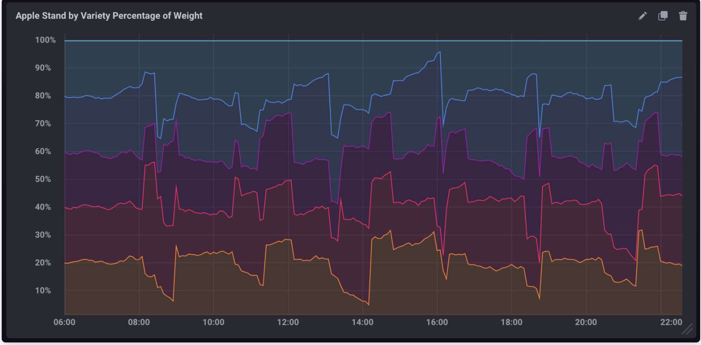
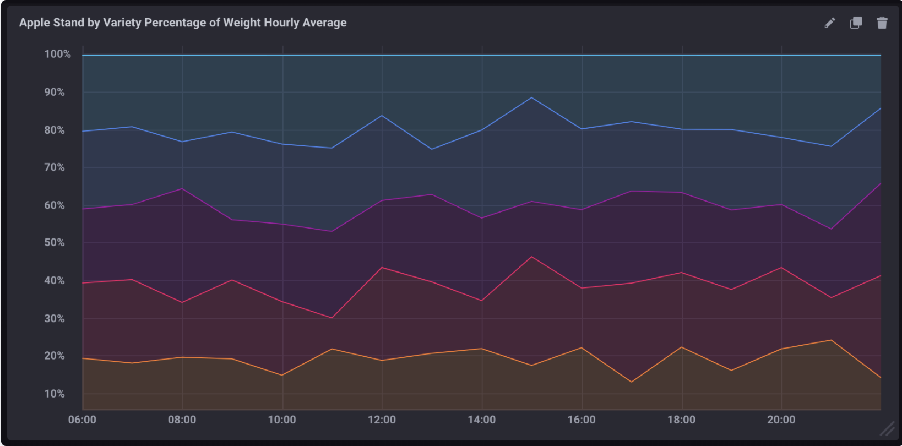

使用Flux或者influxQL计算查询中的百分比


{}
[Flux](#)
[InfluxQL](#)
{}

{}

Flux使您可以执行简单的数学方程式，例如计算百分比

## 计算百分比

通过以下示例了解如何计算百分比

- [查询中的基本运算](#basic-calculations-within-a-query)

- [从两个fields计算百分比](#calculate-a-percentage-from-two-fields)

- [使用聚合函数计算百分比](#calculate-a-percentage-using-aggregate-functions)
- [计算每个苹果品种的总重量百分比](#calculate-the-percentage-of-total-weight-per-apple-variety)
- [计算每个品种的总百分比](#calculate-the-percentage-of-total-weight-per-apple-variety)

## Basic calculations within a query

在Flux查询中执行任何数学运算，必须完成以下步骤

1. 指定要查询的[bucket](/flux/latest/introduction/getting-started/#buckets)和要查询的时间范围
2. 通过measurement、fields或者其它条件过滤需要的数据
3. 使用以下功能之一将值对齐到一行（需要使用Flux执行数学运算）
   - 要从多个数据源查询, 请使用join功能 [`join()` function](/flux/latest/stdlib/built-in/transformations/join/).
   - 要从多个数据源进行查询，请使用pivot功能,  [`pivot()` function](/flux/latest/stdlib/built-in/transformations/pivot/).

有关使用该join()函数计算百分比的示例 以及有关计算百分比的更多示例，请参见 [使用 Flux计算百分比](/flux/latest/guides/calculate-percentages/).

#### 数据变量

为了简化示例，将基本的Flux查询存储在`data`变量中以供重用

这是Flux中的外观

```js
// Query data from the past 15 minutes pivot fields into columns so each row
// contains values for each field
data = from(bucket:"your_db/your_retention_policy")
  |> range(start: -15m)
  |> filter(fn: (r) =>  r._measurement == "measurement_name" and r._field =~ /field[1-2]/)
  |> pivot(rowKey:["_time"], columnKey: ["_field"], valueColumn: "_value")
```

每一行都包含执行数学运算所需要的值，例如，要添加两个field key ，要从上面创建的`data`变量开始，然后使用”map()“重新映射每行中的值

```js
data
 |> map(fn: (r) => ({ r with _value: r.field1 + r.field2}))
```

> 注意：Flux支持基本的数学运算，例如，+，-，/，*，和（）。例如，field2要从中减去field1,请更改+为-

## calculate-a-percentage-from-two-fields

使用上面创建的`data`变量，然后使用 [`map()` 函数](/flux/latest/stdlib/built-in/transformations)将一个filed除以另一个filed，再乘以100，然后添加一个新`percent`fileds以存储percentage values

```js
data
   |> map(fn: (r) => ({
    _time: r._time,
    _measurement: r._measurement,
    _field: "percent",
    _value: field1 / field2 * 100.0
  }))
```

>注意：在此示例中，field1和field2是浮点值，因此乘以100.0，对于整数值，乘以100或使用“float()”函数将整数转换为浮点数

## calculate-a-percentage-using-aggregate-functions

使用 [`aggregateWindow()`](/flux/latest/stdlib/built-in/transformations/aggregates/aggregatewindow)按时间对数据进行窗口处理，并对每个窗口执行聚合功能

```js
from(bucket:"<database>/<retention_policy>")
  |> range(start: -15m)
  |> filter(fn: (r) =>  r._measurement == "measurement_name" and r._field =~ /fieldkey[1-2]/)
  |> aggregateWindow(every: 1m, fn:sum)
  |> pivot(rowKey:["_time"], columnKey: ["_field"], valueColumn: "_value")
  |> map(fn: (r) => ({ r with _value: r.field1 / r.field2 * 100.0 }))
```

## calculate-the-percentage-of-total-weight-per-apple-variety

使用模拟的苹果摊位数据跟踪一天中苹果的重量（按类型）

1. [下载样本数据](https://gist.githubusercontent.com/sanderson/8f8aec94a60b2c31a61f44a37737bfea/raw/c29b239547fa2b8ee1690f7d456d31f5bd461386/apple_stand.txt)
2. 导入样本数据:

```bash
influx -import -path=path/to/apple_stand.txt -precision=ns -database=apple_stand
```

使用以下查询来计算每个品种在每个指定时间点占总重量的百分比

```js
from(bucket:"apple_stand/autogen")
    |> range(start: 2018-06-18T12:00:00Z, stop: 2018-06-19T04:35:00Z)
    |> filter(fn: (r) =>  r._measurement == "variety")
    |> pivot(rowKey:["_time"], columnKey: ["_field"], valueColumn: "_value")
    |> map(fn: (r) => ({ r with
      granny_smith: r.granny_smith / r.total_weight * 100.0 ,
      golden_delicious: r.golden_delicious / r.total_weight * 100.0 ,
      fuji: r.fuji / r.total_weight * 100.0 ,
      gala: r.gala / r.total_weight * 100.0 ,
      braeburn: r.braeburn / r.total_weight * 100.0 ,}))
```

## 计算每小时每个品种总重量的平均百分比

利用前面例子中的苹果架数据，使用下面的查询来计算每个品种每小时占总重量的平均百分比。

```js
from(bucket:"apple_stand/autogen")
  |> range(start: 2018-06-18T00:00:00.00Z, stop: 2018-06-19T16:35:00.00Z)
  |> filter(fn: (r) => r._measurement == "variety")
  |> aggregateWindow(every:1h, fn: mean)
  |> pivot(rowKey:["_time"], columnKey: ["_field"], valueColumn: "_value")
  |> map(fn: (r) => ({ r with
    granny_smith: r.granny_smith / r.total_weight * 100.0,
    golden_delicious: r.golden_delicious / r.total_weight * 100.0,
    fuji: r.fuji / r.total_weight * 100.0,
    gala: r.gala / r.total_weight * 100.0,
    braeburn: r.braeburn / r.total_weight * 100.0
  }))
```

{}

{}

[InfluxQL](/influxdb/v1.8/query_language/) 使您可以执行简单的数学方程式，从而使用measurement中的两个字段计算百分比非常简单，但是，您需要注意一些注意事项

## 查询中的基本计算

`SELECT申明支持使用基本的数据运算符号，如 `+`,`-`,`/`, `*`, `()`, 等

```sql
-- Add two field keys
SELECT field_key1 + field_key2 AS "field_key_sum" FROM "measurement_name" WHERE time < now() - 15m

-- Subtract one field from another
SELECT field_key1 - field_key2 AS "field_key_difference" FROM "measurement_name" WHERE time < now() - 15m

-- Grouping and chaining mathematical calculations
SELECT (field_key1 + field_key2) - (field_key3 + field_key4) AS "some_calculation" FROM "measurement_name" WHERE time < now() - 15m
```

## 计算查询中的百分比

使用基本的数据函数，可以通过将一个字段值除以另一个字段值并将结果乘以100来计算百分比

```sql
SELECT (field_key1 / field_key2) * 100 AS "calculated_percentage" FROM "measurement_name" WHERE time < now() - 15m
```

## 使用聚合函数计算百分比

如果在百分比计算中使用汇总函数，则必须要使用汇总函数引用所有数据， 不能混合汇总数据和非汇总数据

所有聚合功能都需要一个`GROUP BY time()`子句，该子句定义将数据点分组和聚合的时间间隔

```sql
SELECT (sum(field_key1) / sum(field_key2)) * 100 AS "calculated_percentage" FROM "measurement_name" WHERE time < now() - 15m GROUP BY time(1m)
```

## 例子

#### 样本数据

下面的示例使用模拟的Apple Stand数据，该数据跟踪一天中营业的装有不同品种苹果的篮子重量

1. [下载样本数据](https://gist.githubusercontent.com/sanderson/8f8aec94a60b2c31a61f44a37737bfea/raw/c29b239547fa2b8ee1690f7d456d31f5bd461386/apple_stand.txt)
2. 导 入样本数据:

```bash
influx -import -path=path/to/apple_stand.txt -precision=ns -database=apple_stand
```

### 计算每种苹果品种总重量的百分比

以下查询计算每个品种在每个给定时间点占总重量的百分比

```sql
SELECT
    ("braeburn"/total_weight)*100,
    ("granny_smith"/total_weight)*100,
    ("golden_delicious"/total_weight)*100,
    ("fuji"/total_weight)*100,
    ("gala"/total_weight)*100
FROM "apple_stand"."autogen"."variety"
```
<div class='view-in-chronograf' data-query-override='SELECT
    ("braeburn"/total_weight)*100,
    ("granny_smith"/total_weight)*100,
    ("golden_delicious"/total_weight)*100,
    ("fuji"/total_weight)*100,
    ("gala"/total_weight)*100
FROM "apple_stand"."autogen"."variety"'>
\*</div>
如果在Chronograf中将其可视化为堆叠图，则它将看起来像：



### 计算每个品种的总百分比

以下查询计算每个品种每小时占总重量的平均百分比

```sql
SELECT
    (mean("braeburn")/mean(total_weight))*100,
    (mean("granny_smith")/mean(total_weight))*100,
    (mean("golden_delicious")/mean(total_weight))*100,
    (mean("fuji")/mean(total_weight))*100,
    (mean("gala")/mean(total_weight))*100
FROM "apple_stand"."autogen"."variety"
WHERE time >= '2018-06-18T12:00:00Z' AND time <= '2018-06-19T04:35:00Z'
GROUP BY time(1h)
```
<div class='view-in-chronograf' data-query-override='SELECT%0A%20%20%20%20%28mean%28"braeburn"%29%2Fmean%28total_weight%29%29%2A100%2C%0A%20%20%20%20%28mean%28"granny_smith"%29%2Fmean%28total_weight%29%29%2A100%2C%0A%20%20%20%20%28mean%28"golden_delicious"%29%2Fmean%28total_weight%29%29%2A100%2C%0A%20%20%20%20%28mean%28"fuji"%29%2Fmean%28total_weight%29%29%2A100%2C%0A%20%20%20%20%28mean%28"gala"%29%2Fmean%28total_weight%29%29%2A100%0AFROM%20"apple_stand"."autogen"."variety"%0AWHERE%20time%20>%3D%20%272018-06-18T12%3A00%3A00Z%27%20AND%20time%20<%3D%20%272018-06-19T04%3A35%3A00Z%27%0AGROUP%20BY%20time%281h%29'></div>

请注意以下有关此查询的内容

- 它使用聚合函数（mean（））提取所有数据.

- 它包含一个GROUP BY time（）将数据聚合为1小时块的子句

- 它包含一个明确限制的时间窗口，没有它，聚合功能将占用大量资源
  
  如果在Chronograf中将其可视化为堆叠图，则它将看起来像：
  
  

{}
